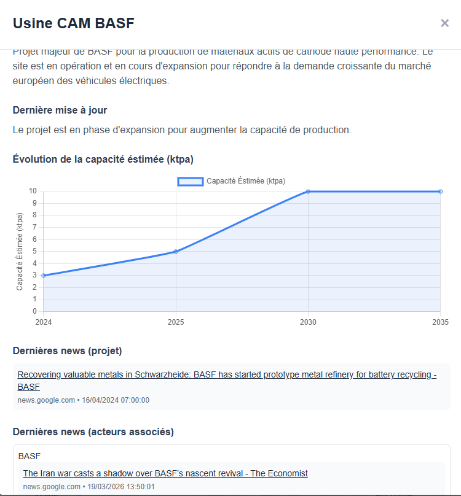
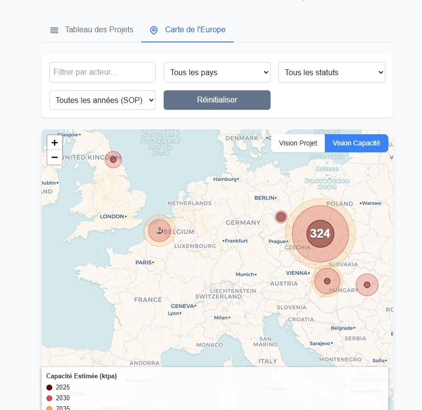

# 🔋 Strategic Monitoring: EU Cathode Active Materials (CAM) Producers

[](https://www.python.org/)
[]()
[]()

## 📝 Présentation du Projet

Ce projet est un outil de **veille stratégique et d'analyse de marché** dédié à l'écosystème européen des **Matériaux Actifs de Cathode (CAM)**. Dans le contexte de la transition vers la mobilité électrique, la maîtrise de la production de CAM est un enjeu de souveraineté industrielle majeur pour l'Europe.

L'objectif de ce dépôt est de centraliser, traiter et visualiser les données relatives aux acteurs clés, aux capacités de production actuelles et futures, ainsi qu'aux partenariats stratégiques du secteur.

### Aperçu de l'Interface de Monitoring

Voici un aperçu visuel des outils d'analyse développés dans ce projet :

<p align="center">
  
  <br>
  <em>Figure 1 : Tableau de bord consolidé présentant les indicateurs clés (KPI) de capacité nationale et la répartition géographique des projets.</em>
</p>

<p align="center">
  
  <br>
  <em>Figure 2 : Vue détaillée de l'analyse stratégique, incluant le statut des projets, l'analyse d'IA (Gemini) sur les risques/opportunités, et les technologies utilisées.</em>
</p>

---

## 🚀 Fonctionnalités Clés

- **Tableau de Bord Interactif** : Interface HTML de monitoring stratégique permettant de visualiser l'état de l'art du marché (Figure 1).
- **Cartographie des Acteurs & Analyse d'IA** : Synthèse stratégique par entreprise assistée par IA (Risques/Opportunités, Techno, Clients) (Figure 2).
- **Analyse de Capacité** : Suivi précis des capacités de production (en ktpa) avec projections à l'horizon 2030 et 2035.
- **Suivi de l'Offre et de la Demande** : Modélisation basée sur les données BMI (Benchmark Mineral Intelligence) pour anticiper les déséquilibres du marché.
- **Intelligence Relationnelle** : Analyse des partenariats, joint-ventures et accords de licence (ex: IONWAY, LICAMAX).

---

## 📂 Structure des Données

Le projet s'appuie sur une structure de données multi-sources :

| Fichier / Module | Description |
| :--- | :--- |
| `Strategic Monitoring - EU CAM Producer.html` | 🌐 Interface de visualisation interactive pour les décideurs. |
| `BMI - Cathode Capacity.csv` | 📊 Données historiques et prévisionnelles de capacité par site. |
| `Fiches Acteur - Gemini.csv` | 🏢 Synthèse stratégique par entreprise. |
| `BMI - Partnership.csv` | 🤝 Registre des accords stratégiques et investissements. |
| `State of the Art.csv` | 📍 État d'avancement des projets (SOP, Statut, Localisation). |

---

## 🛠️ Installation et Utilisation

### Prérequis
Pour exploiter les données et générer les analyses, les bibliothèques suivantes sont recommandées :
```bash
pip install pandas numpy matplotlib seaborn
